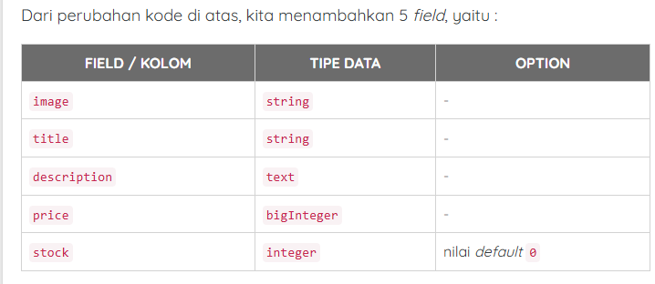
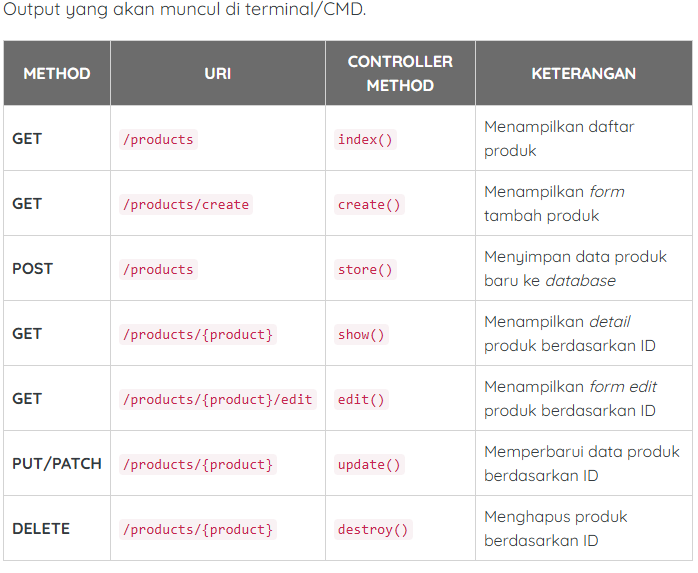

# Tutorial CRUD Laravel 12

## 1.Konfigurasi File System

### 1.1 Konfigurasi File .env

pada .env ubah `FILESYTEM_DISK=local` menjad public `FILESYSTEM_DISK=public`

### 1.2 Menjalankan Storage Link

```sh
php artisan storage:link
```

## 2.Membuat Model dan migrate

### 2.1 Konfigurasi koneksi database

pada file `.env` yang sebelumnya:

```sh
DB_CONNECTION=sqlite
# DB_HOST=127.0.0.1
# DB_PORT=3306
# DB_DATABASE=laravel
# DB_USERNAME=root
# DB_PASSWORD=
```

menjadi

```sh
DB_CONNECTION=mysql
DB_HOST=127.0.0.1
DB_PORT=3306
DB_DATABASE=db_laravel_12
DB_USERNAME=root
DB_PASSWORD=
```

untuk memastikan konfigurasi databse diterapkan jalankan perintah ini:

```sh
php artisan config:clear
```

### 2.2 Membuat Model dan Migration

membuat model dan migration sekaligus seperti berikut:

```sh
php artisan make:model Product -m
```

dari perintah di atas:

-   `php artisan make:model Product ` : membuat model dengan nama product
-   `-m` : membuat file migration untuk model tersebut

jika berhasil dijalakan akan terbuat 2 file :

-   app/Models/Product.php
-   databae/migrations/tahun_bulan_tanggal_jam_create_procuts_table.php

### 2.3 Menambahkan field / kolom di migration

membuat tabel untuk database

```sh
public function up(): void
{
    Schema::create('products', function (Blueprint $table) {
        $table->id();
        $table->string('image');
        $table->string('title');
        $table->text('description');
        $table->bigInteger('price');
        $table->integer('stock')->default(0);
        $table->timestamps();
    });
}

```



### 2.4 Konfigurasi Mass Assigment

pada file `app/Models/Product.php` ubah menjadi :

```php
<?php

namespace App\Models;

use Illuminate\Database\Eloquent\Factories\HasFactory;
use Illuminate\Database\Eloquent\Model;

class Product extends Model
{
    use HasFactory;

    /**
     * fillable
     *
     * @var array
     */
    protected $fillable = [
        'image',
        'title',
        'description',
        'price',
        'stock',
    ];
}
```

### 2.5 Menjalankan migration

untuk menjalankannya pastikan terminal /CMD berada pada project laravelnya lalu jalankan perintah ini:

```sh
php artisan migrate
```

## 3.Menampilkan Data dari Database

### 3.1 Membuat Controller Product

Controller berfungsi sebagai penghubung antara **Model**(database) dan **View**(tampilan antarmuka pengguna), langkahnya:

1. Buat Controller menggunakan prompt

```sh
php artisan make:controller ProductController
```

2. pada `app/Http/Controllers/ProductController.php` buat kode ini

```php
<?php

namespace App\Http\Controllers;

//import model product
use App\Models\Product;

//import return type View
use Illuminate\View\View;

class ProductController extends Controller
{
    /**
     * index
     *
     * @return void
     */
    public function index() : View
    {
        //get all products
        $products = Product::latest()->paginate(10);

        //render view with products
        return view('products.index', compact('products'));
    }
}
```

### 3.2 Membuat Route Products

silahkan buka `routes/web.php` lalu ubah kode jadi seperti ini:

```php
<?php

use Illuminate\Support\Facades\Route;

//import product controller
use App\Http\Controllers\ProductController;

//route resource for products
Route::resource('/products', ProductController::class);

Route::get('/', function () {
    return view('welcome');
});
```

hanya dengan 1 baris kode di atas, Laravel akan otomati membuat 7 route bawaan untuk **CRUD** produk. Untuk melihat daftar lengkap route yang dibuat, jalankan perintah ini di terminal/CMD.

```sh
php artisan route:list
```



### 3.3 Membuat View Products Index

buat file pada `resource/views/products/index.blade.php` kemudian masukan kode ini
[index.blade.php](resources/views/products/index.blade.php)

pada kode ada pengulangan menggunakan `@forelse`:

```php
@forelse ($products as $product)

	//tampilkan data product.

@empty

	// data produk belum ada.

@endforelse
```

dan untuk menampilkan pagination, bisa menggunakan `links`

```php
{{ $products->links() }}
```

lalu jalankan dan tampilkan jangan lupa `php artisan serve` harus sudah aktif
