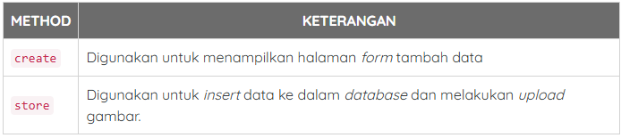
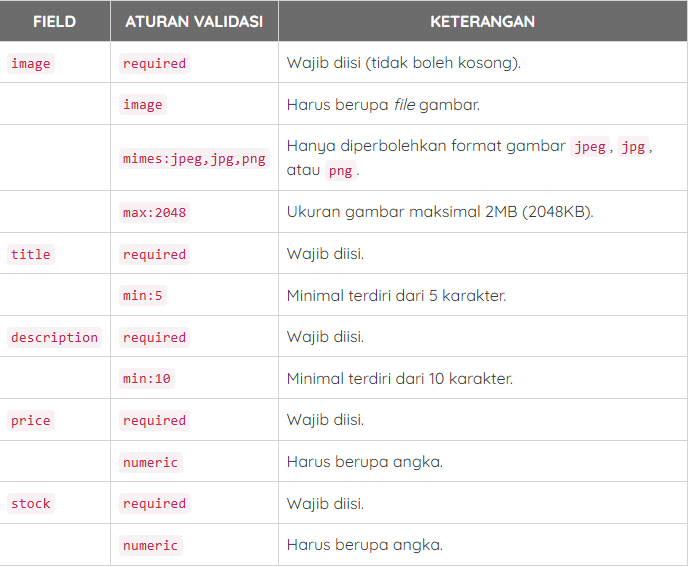
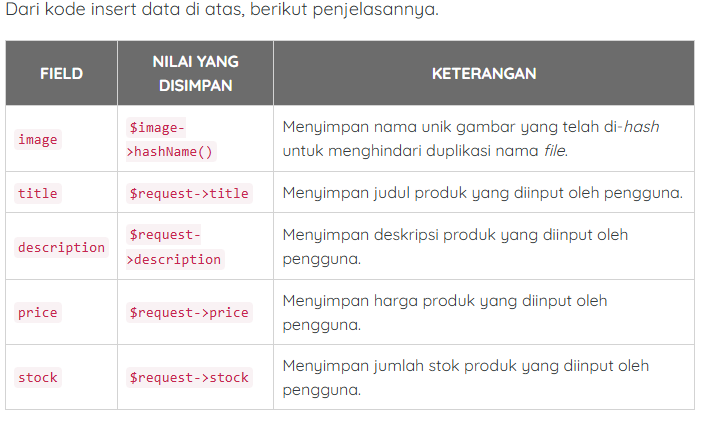
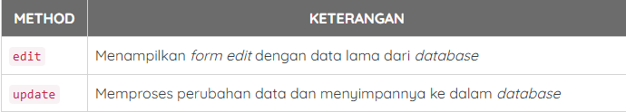

# Tutorial CRUD Laravel 12

## 1. Konfigurasi File System

### 1.1 Konfigurasi File .env

pada .env ubah `FILESYTEM_DISK=local` menjad public `FILESYSTEM_DISK=public`

### 1.2 Menjalankan Storage Link

```sh
php artisan storage:link
```

## 2. Membuat Model dan migrate

### 2.1 Konfigurasi koneksi database

pada file `.env` yang sebelumnya:

```sh
DB_CONNECTION=sqlite
# DB_HOST=127.0.0.1
# DB_PORT=3306
# DB_DATABASE=laravel
# DB_USERNAME=root
# DB_PASSWORD=
```

menjadi

```sh
DB_CONNECTION=mysql
DB_HOST=127.0.0.1
DB_PORT=3306
DB_DATABASE=db_laravel_12
DB_USERNAME=root
DB_PASSWORD=
```

untuk memastikan konfigurasi databse diterapkan jalankan perintah ini:

```sh
php artisan config:clear
```

### 2.2 Membuat Model dan Migration

membuat model dan migration sekaligus seperti berikut:

```sh
php artisan make:model Product -m
```

dari perintah di atas:

-   `php artisan make:model Product ` : membuat model dengan nama product
-   `-m` : membuat file migration untuk model tersebut

jika berhasil dijalakan akan terbuat 2 file :

-   app/Models/Product.php
-   databae/migrations/tahun_bulan_tanggal_jam_create_procuts_table.php

### 2.3 Menambahkan field / kolom di migration

membuat tabel untuk database

```sh
public function up(): void
{
    Schema::create('products', function (Blueprint $table) {
        $table->id();
        $table->string('image');
        $table->string('title');
        $table->text('description');
        $table->bigInteger('price');
        $table->integer('stock')->default(0);
        $table->timestamps();
    });
}

```


### 2.4 Konfigurasi Mass Assigment

pada file `app/Models/Product.php` ubah menjadi :

```php
<?php

namespace App\Models;

use Illuminate\Database\Eloquent\Factories\HasFactory;
use Illuminate\Database\Eloquent\Model;

class Product extends Model
{
    use HasFactory;

    /**
     * fillable
     *
     * @var array
     */
    protected $fillable = [
        'image',
        'title',
        'description',
        'price',
        'stock',
    ];
}
```

### 2.5 Menjalankan migration

untuk menjalankannya pastikan terminal /CMD berada pada project laravelnya lalu jalankan perintah ini:

```sh
php artisan migrate
```

<<<<<<< HEAD

## 3. Menampilkan Data dari Database

### 3.1 Membuat Controller Product

Controller berfungsi sebagai penghubung antara **Model**(database) dan **View**(tampilan antarmuka pengguna), langkahnya:

1. Buat Controller menggunakan prompt

```sh
php artisan make:controller ProductController
```

2. pada `app/Http/Controllers/ProductController.php` buat kode ini

```php
<?php

namespace App\Http\Controllers;

//import model product
use App\Models\Product;

//import return type View
use Illuminate\View\View;

class ProductController extends Controller
{
    /**
     * index
     *
     * @return void
     */
    public function index() : View
    {
        //get all products
        $products = Product::latest()->paginate(10);

        //render view with products
        return view('products.index', compact('products'));
    }
}
```

dari kode di atas, pertama kita tentukan `namespace` atau lokasi conroller ini berada

```php
namespace App\Http\Controllers;
```

kemudian import Model `product`, dimana digunakan untuk mengambil data dari table `products` di database.

```php
//import model product
use App\Models\Product;
```

selanjutnya import class `view` yang nanti digunakan sebagai tipe pengembalian untuk method `index`

```php
//import return type View
use Illuminate\View\View;
```

### 3.2 Membuat Route Products

silahkan buka `routes/web.php` lalu ubah kode jadi seperti ini:

```php
<?php

use Illuminate\Support\Facades\Route;

//import product controller
use App\Http\Controllers\ProductController;

//route resource for products
Route::resource('/products', ProductController::class);

Route::get('/', function () {
    return view('welcome');
});
```

hanya dengan 1 baris kode di atas, Laravel akan otomati membuat 7 route bawaan untuk **CRUD** produk. Untuk melihat daftar lengkap route yang dibuat, jalankan perintah ini di terminal/CMD.

```sh
php artisan route:list
```


### 3.3 Membuat View Products Index

buat file pada `resource/views/products/index.blade.php` kemudian masukan kode ini
[index.blade.php](resources/views/products/index.blade.php)

pada kode ada pengulangan menggunakan `@forelse`:

```php
@forelse ($products as $product)

	//tampilkan data product.

@empty

	// data produk belum ada.

@endforelse
```

dan untuk menampilkan pagination, bisa menggunakan `links`

```php
{{ $products->links() }}
```

lalu jalankan dan tampilkan jangan lupa `php artisan serve` harus sudah aktif

## 4. Insert Data ke Dalam Database

### 4.1 Membuat Method `create` dan `store` di Controller

[Controller Product](app/Http/Controllers/ProductController.php) setelah menambahkan method create dan store yang digunakan untuk: <br>


dari kode di atas, pertama kita import return type `RedirectResponse`

```php
//import return type redirectResponse
use Illuminate\Http\RedirectResponse;
```

kemudian kita import juga `Http Request`

```php
//import Http Request
use Illuminate\Http\Request;
```

#### Function Create

hanya mereturn sebuah view pada file `resource/views/products/create.blade.php`

#### Function Store

di sini kita menerima inputan ditangkap menggunakan sebuah `Reques: $request`
lalu ditambahkan sebuah validasi input:

```php
//validate form
$request->validate([
    'image'         => 'required|image|mimes:jpeg,jpg,png|max:2048',
    'title'         => 'required|min:5',
    'description'   => 'required|min:10',
    'price'         => 'required|numeric',
    'stock'         => 'required|numeric'
]);
```

penjelasannya: <br>


untuk melakukan upload gambar menggunakna method `storeAs`, laravel akan:

1. Cek apakah folder storage/app/public/products sudah ada.

2. Kalau belum ada, otomatis bikin foldernya.

3. Simpan file di dalamnya.

```php
//upload image
$image = $request->file('image');
$image->storeAs('products', $image->hashName());
```

setelah gambar sudah diupload, maka selanjutnya adalah proses insert data ke dalam database menggunakan `Model`

```php
//create product
Product::create([
    'image'         => $image->hashName(),
    'title'         => $request->title,
    'description'   => $request->description,
    'price'         => $request->price,
    'stock'         => $request->stock
]);
```



lalu jika sudah berhasil di insert maka tinggal di rederict ke halaman `products.index`, jangan lupa tambahkan sebuah session flash data untuk menampilkan notifikasinya

```php
//redirect to index
return redirect()->route('products.index')->with(['success' => 'Data Berhasil Disimpan!']);
```

### 4.2 Membuat Form Tambah Data

setelah membuat `create.blade.php` di `resource/views/products/`
kurang lebih strukturnya seperti ini:

```sh
resources
└── views
    └── products
        ├── index.blade.php
        ├── create.blade.php <-- (File yang akan kita buat)
```

[products.create](resources/views/products/create.blade.php)

pada form yang sudah dibuat :

```php
<form action="{{ route('products.store') }}" method="POST" enctype="multipart/form-data">
    @csrf
	//...

</form>
```

ada action yang mengarahkan route ke method store, lalu ada enctype untuk inputan file, dan ada @csrf itu sebagai token yang harus ada ketika menginputan suatu request pada form, dan selesai bisa dicoba

## 5. Menampilkan Detail Data By ID

### 5.1 Menambahkan method `show` di Controller

[Controller Product](app/Http/Controllers/ProductController.php) setelah menambahkan method show yang menerima paramater `$id` pada controller:

```php
public function show(string $id): View
{

	//...

}
```

langkah selanjutnya adalah:

1. cari id product menggunakan method `findOrFail`

```php
//get product by ID
$product = Product::findOrFail($id);
```

2. lalu mereturn `$product` ke halaman `products.show`

```php
//render view with product
return view('products.show', compact('product'));
```

untuk mengirimkan `$id` dari halaman `products.inde` caranya:

```php
<a href="{{ route('products.show', $product->id) }}" class="btn btn-sm btn-dark">SHOW</a>
```

### 5.2 Membuat view detail pada product

setelah membuat `show.blade.php` di `resource/views/products/`
kurang lebih strukturnya seperti ini:

```sh
resources
└── views
    └── products
        ├── index.blade.php
        ├── create.blade.php
        ├── show.blade.php  <-- (File yang akan kita buat)
```

[products.show](resources/views/products/show.blade.php)
yang perlu diperhatikan di sini yaitu cara panggil image dan cara panggil atribut dari objek product yang sebelumnya sudah kita kirim dari kontroller cara panggilnya:

1. Menampilkan gambar

```php
image) }}" class="rounded" style="width: 100%">
```

2. Menampilkan atribut

```php
// menampilkan title
{{ $product->title }}

// menampilkan harga
{{ "Rp " . number_format($product->price,2,',','.') }}

// menampilkan description, karena description ada sintak html tambahkan `!!`
{!! $product->description !!}

// menampilkan stock
{{ $product->stock }}

```

dan silahkan coba

## 6. Edit dan Update Data ke Database

### 6.1 Membuat Method `edit` dan `update` di controller

[Controller Product](app/Http/Controllers/ProductController.php) setelah menambahkan method edit dan update yang digunakan untuk: <br>


pada kode di atas kita mengimport Facades `Storage` dari laravel, yang digunakan untuk menghapus file gambar product lama saat gambar diperbarui.

```php
//import Facades Storage
use Illuminate\Support\Facades\Storage;
```

#### Function Edit

untuk mengirimkan `$id` dari index caranya:

```php
<a href="{{ route('products.edit', $product->id) }}" class="btn btn-sm btn-primary">EDIT</a>
```

pada `app/Http/Controllers/ProductController.php`, menambahkan fungsi untuk method edit

```php
public function edit(string $id): View
{

	//...

}
```

lalu cari data di database berdasarkan id

```php
//get product by ID
$product = Product::findOrFail($id);
```

dan tinggal kirim ke dalam view menggunakan `compact`

```php
//render view with product
return view('products.edit', compact('product'));
```

#### Function Store

Di dalam method ini terdapat 2 paramater, yaitu `$request` dan `$id`

1. `$request` digunakan untuk menerima inputan / request data yang dikirimkan oleh pengguna melalui form
2. `$id` merupakan **ID** data product yang akan dijadikan acuan update data

```php
public function update(Request $request, $id): RedirectResponse
{

	//...

}
```

di dalam method di atas, pertama kita membuat sebuah validasi terlebih dahulu:

```php
//validate form
$request->validate([
    'image'         => 'image|mimes:jpeg,jpg,png|max:2048',
    'title'         => 'required|min:5',
    'description'   => 'required|min:10',
    'price'         => 'required|numeric',
    'stock'         => 'required|numeric'
]);
```

selanjutnya get data product dari database berdasarkan `$id`

```php
//get product by ID
$product = Product::findOrFail($id);
```

kemudian membuat kondisi untuk gambar, jika ada sebuah request file dengan nama `image`, maka upload gambar baru dan hapus gambar lama

```php
//check if image is uploaded
if ($request->hasFile('image')) {

	//hapus gambar lama
    Storage::delete('products/'.$product->image);

	//upload gambar baru
    $image = $request->file('image');
    $image->storeAs('products', $image->hashName());

	//update dengan gambar
    $product->update([
    'image'         => $image->hashName(),
    'title'         => $request->title,
    'description'   => $request->description,
    'price'         => $request->price,
    'stock'         => $request->stock
]);

} else {

	//update tanpa gambar
    $product->update([
        'title'         => $request->title,
        'description'   => $request->description,
        'price'         => $request->price,
        'stock'         => $request->stock
    ]);
}
```

dan yang terakhir tinggal redirect ke dalam sebuah route dengan nama `products.index` dengan menambahkan flash data.

```php
//redirect to index
return redirect()->route('products.index')->with(['success' => 'Data Berhasil Diubah!']);
```

### 6.2 Membuat View Form Edit Data

setelah membuat `edit.blade.php` di `resource/views/products/`
kurang lebih strukturnya seperti ini:

```sh
resources
└── views
    └── products
        ├── index.blade.php
        ├──	create.blade.php
        ├── show.blade.php
        ├── edit.blade.php <-- (File yang akan kita buat)
```

[products.edit](resources/views/products/edit.blade.php)
yang perlu diperhatikan di sini yaitu:

1. Untuk mengisi value kita panggil object dari data product di dalam helper `old`, contohnya:

```php
{{ old('title', $product->title) }}
```

```php
<input type="text" class="form-control @error('title') is-invalid @enderror" name="title" value="{{ old('title', $product->title) }}" placeholder="Masukkan Judul Product">
```

2. jangan lupa, untuk halaman form edit, pastikan untuk menambahkan method `put` di dalamnya, ini menandakan bahwa form tersebut adalah form edit data.

```php
<form action="{{ route('products.update', $product->id) }}" method="POST" enctype="multipart/form-data">
    @csrf
    @method('PUT')
```

## 7. Delete Data dari Database

### 7.1 Menambahkan method `destroy` di controller

pada [Controller Product](app/Http/Controllers/ProductController.php) kita menambahkan function destroy

```php
public function destroy($id): RedirectResponse
{

	//...

}
```

pertama cari product di database berdasarkan `$id`

```php
//get product by ID
$product = Product::findOrFail($id);
```

kedua jika sudah, maka delete gambar

```php
//delete image
Storage::delete('products/'. $product->image);
```

ketiga hapus data dari database

```php
//delete product
$product->delete();
```

keempat redirect ke file `products.index` dengan memberikan session flash data

```php
//redirect to index
return redirect()->route('products.index')->with(['success' => 'Data Berhasil Dihapus!']);
```

### 7.2 Menambahkan form delete pada `products.index`

bungkus button delete pada `products.index` dengan tag form, lalu tambahkan confirm untuk konfirmasi, dan tambahkan `@method('DELETE')`

```php
<form onsubmit="return confirm('Apakah Anda Yakin ?');" action="{{ route('products.destroy', $product->id) }}" method="POST">
    @csrf
    @method('DELETE')
    <button type="submit" class="btn btn-sm btn-danger">HAPUS</button>
</form>
```
